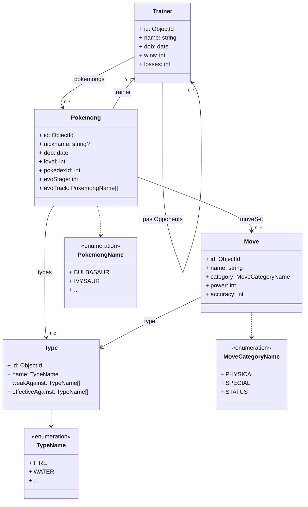
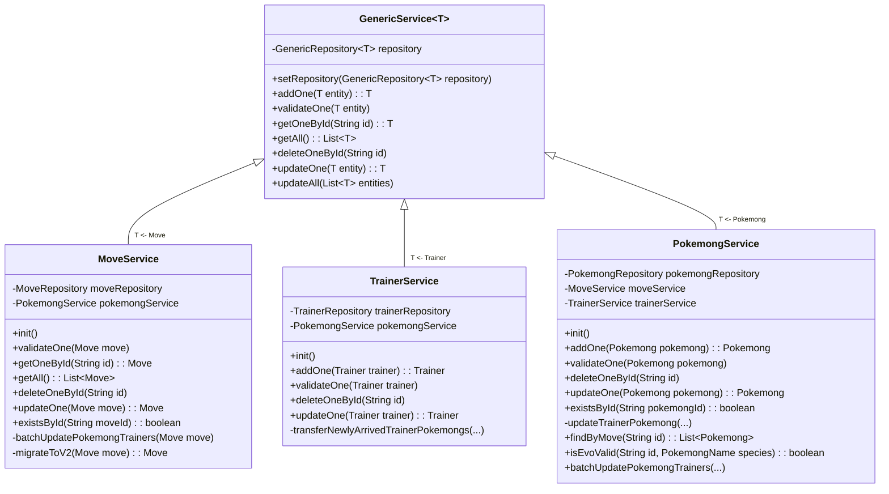

# PoKeMoNg

- [About](#about)
    - [🗂️DCM](#dcm)
        - [`Trainer`](#trainer)
        - [`Pokemong`](#pokemong)
        - [`Move`](#move)
        - [`Type`](#type)
    - [🧬UML Class diagram](#uml-class-diagram)
    - [🗺NoSQL Schema Versioning Strategy](#nosql-schema-versioning-strategy)
        - [Schema Versioning Pattern](#schema-versioning-pattern)
        - [Incremental Document Migration](#incremental-document-migration)
    - [📇Indexes](#indexes)
        - [`moves` collection](#moves-collection)
        - [`pokemongs` collection](#pokemongs-collection)
        - [`trainers` collection](#trainers-collection)
    - [🐕‍🦺Services](#services)
    - [🌺Special requests](#special-requests)
        - [`Pokemong` by nickname](#pokemong-by-nickname)
        - [`Pokemong` in date interval](#pokemong-in-date-interval)
    - [🦚Aggregation pipeline](#aggregation-pipeline)
    - [👔Some business rules](#some-business-rules)
        - [`Move` CRUD cascade](#move-crud-cascade)
        - [`Pokemong` CRUD cascade](#pokemong-crud-cascade)
        - [`Trainer` CRUD cascade](#trainer-crud-cascade)
- [Prep steps](#prep-steps)
    - [♨️Java version](#java-version)
    - [🔐Database connection](#database-connection)
- [Running the application in dev mode](#running-the-application-in-dev-mode)
- [API testing](#api-testing)
    - [🧪Sample dataset](#sample-dataset)
    - [🩺API testing tools](#api-testing-tools)
    - [📱Front end](#front-end)
    - [🏴‍☠️SwaggerUI](#swaggerui)
- [Known limitations](#known-limitations)
    - [🔀Types are left at the user's mercy](#types-are-left-at-the-users-mercy)

This is a [Quarkus](https://quarkus.io/) / [MongoDB](https://mongodb.com/) app for educational purposes.

Instructions are [here](https://clientserveur-courses.clubinfo-clermont.fr/Notation.html) for reference.

## About

A "Pokemong" is a playful term for a MongoDB pocket monster.

The application is developed using the Quarkus framework and uses MongoDB as its database.

This application is a RESTful service designed to emulate a basic `Pokemong` management system. It allows users to
perform
CRUD operations on `Pokemongs`, `Trainers`, and `Moves`.

### 🗂️DCM

Let's cover the entities and relationships in this Data Concept Model:

#### `Trainer`

These are the individuals who capture and train `pokemongs`. They can engage in battles with other `trainers.`

* a `trainer` has fought between 0 and many `trainers`
    * we will use *referencing*, since this is a reflexive relationship
* a `trainer` owns between 0 and many `pokemongs`
    * we will use *referencing with denormalizing*, since `pokemongs` have lifecycles of their own

#### `Pokemong`

These are the creatures that `trainers` capture and train. They can be trained or wild.

* a `pokemong` is owned by 0 or 1 `trainer`
    * we will use *referencing*, since `trainers` have lifecycles of their own, but no denormalizing, since no queries
      need that
* a `pokemong` has 1 or 2 `types`
    * we will use *embedding*, since `types` don't have lifecycles of their own
* a `pokemong` knows between 0 and 4 `moves`
    * we will use *referencing with denormalizing*, since `moves` have lifecycles of their own

#### `Move`

These are the abilities or actions that a `pokemong` can perform. This covers the strategic aspects of battles, as
different `moves` can have different effects and powers depending on the type of the `pokemong` and the `move`.

* a `move` can be known by between 0 and zillions of `pokemongs`
    * we will let `pokemongs` refer to `moves`, and not the other way around
* a `move` has 1 and only 1 `type`
    * we will use *embedding*, since `types` don't have lifecycles of their own

#### `Type`

These define the elements or categories that a `pokemong` or a `move` can belong to.

* a `type` can define between 0 and zillions of `pokemongs`
    * see [`Pokemong`](#pokemong)
* a `type` can define between 0 and zillions of `moves`
    * see [`Move`](#move)


### 🧬UML Class diagram

Omitting some details, our entities look like this:



### 🗺NoSQL Schema Versioning Strategy

This application uses MongoDB, a NoSQL database, which provides flexibility in our data model. While this flexibility
has
its advantages, it poses a unique challenge when we need to update our data model, specifically when we want to
introduce breaking changes in the existing schema.

We have adopted a schema versioning strategy to overcome this challenge and manage these changes efficiently.

#### Schema Versioning Pattern

Schema versioning is a pattern that involves tagging each document in a collection with a version number. This version
number corresponds to the schema of the document and is used to handle schema changes in the code that reads these
documents.

Each entity in our model extends a `GenericVersionedEntity` class, which includes a `schemaVersion` field. This field is
an integer that starts at 1 and is to be incremented by one with each schema change. Every change to the schema needs to
involve the schema version number being incremented.

#### Incremental Document Migration

When a document is read from the database, the version number in the document is checked. If the version number is less
than the current version, the document is updated to the current version, and the updated document is written back to
the database. This process effectively migrates the document to the current version.

In the example of the `Move` class, the codec's `decodeV1` method handles documents with a `schemaVersion` of less
than `2`. When it reads a document with this version, it updates the `schemaVersion` to `2`, and writes the updated
document back to the database.

```java
Move decodeV1(Document document){
        // ...
        // Increment the schemaVersion to the current version
        move.setSchemaVersion(2);

        // Save the updated Move object back to the database
        moveRepository.persistOrUpdate(move);
        // ...
        }
```

This strategy allows for graceful schema evolution in a NoSQL environment. Instead of requiring all documents to be
migrated at once, which can be a time-consuming operation for large collections, it enables incremental document
migration. This approach also helps to avoid downtime during schema migration, as the application continues to function
correctly regardless of the document version. As documents are read, they are updated to the current schema version,
allowing the schema migration to happen gradually over time.

However, note that this strategy increases write operations to the database, which could affect application performance.

### 📇Indexes

Various indexes were created for fields that would often be queried in a dashboard situation. If there is an additional
reason, it will be specified below.

Unless otherwise specified, please consider indexes to be full, and ascending.

#### `moves` collection

In the front-end app, these are queried both in the detail screen and in the list screen.

* `name`
* `power`: Descending, because users are more likely to sort them in that order.
* `type`

#### `pokemongs` collection

* `nickname`: This field already has a dedicated endpoint for a nickname search filter.
* `dob`: Descending, because users are more likely to sort them in that order.
* `evoStage`: "Species" is calculated as `evoTrack[evoStage]`, and would often be queried.
* `evoTrack`: See `evoStage`. Yes, it's an array, but it's a one-to-few relationship.
* `trainer`: Partial index, to avoid indexing wild pokemongs there.
* `types`: It's an array, but it's a one-to-few relationship.

#### `trainers` collection

It was tempting to index `pastOpponents` and `pokemongs` in the `trainers` collection, but these arrays
could grow indefinitely, and the indexes may grow so large that they wouldn't fit in a server's RAM anymore.

* `name`
* `wins`: Descending, because users are more likely to sort them in that order for rankings.
* `losses`: Descending, because users are more likely to sort them in that order for rankings.

### 🐕‍🦺Services

Each entity (`Pokemong`, `Trainer`, `Move`) in the application has a corresponding service class. These service
classes are responsible for handling the business logic related to their respective entities. They interact with the
database through their associated repositories, performing CRUD operations.

All service classes inherit from a `GenericService` class, which provides the following methods:

* `addOne(T entity)`: Adds a new entity to the database, after validating it.
* `getOneById(String id)`: Retrieves a single entity from the database by its ID.
* `getAll()`: Retrieves all entities of a certain type from the database.
* `deleteOneById(String id)`: Deletes an entity from the database by its ID.
* `updateOne(T entity)`: Updates an existing entity in the database. This method is meant to be overridden in child
  service classes to provide the specific update logic for each type of entity.
* `updateAll(List<T> entities)`: Updates all entities in a given list. Each entity is validated before updating.

These methods allow the application to perform all the basic CRUD operations on any type of entity. The specific logic
for each type of entity (like how to validate a `pokemong`, how to update a `move`, etc.) is provided in the child
service classes that inherit from `GenericService`.

Many business rules were applied, which can be browsed [here](#some-business-rules).

This diagram attempts to show the relationship between services in this API



### 🌺Special requests

This API goes a little bit beyond basic CRUD operations.

#### `Pokemong` by nickname

Using a MongoDB filter with a regex, `pokemongs` are searchable by nickname with the URL `/pokemong/nickname/{nickname}`
where `{nickname}` is a partial, case-insensitive search term.

#### `Pokemong` in date interval

Users can also use the route `pokemong/dob/{start-date}/{end-date}` to search for
`pokemongs` who where born within that interval (bounds included).

### 🦚Aggregation pipeline

Finally, the endpoint `pokemong/count-by-evo-stage` is provided, to get a mapping of evolution stages with
the number of `pokemongs`who achieved that evolution stage.

As an example of a potential output:

```json
[
  {
    "count": 15,
    "evoStage": 0
  },
  {
    "count": 4,
    "evoStage": 1
  },
  {
    "count": 5,
    "evoStage": 2
  }
]
```

### 👔Some business rules

#### `Move` CRUD cascade

* When you delete a `move`, it also gets deleted from any `pokemong`'s `moveSet`.
* Since `pokemongMove` is denormalized on the `name` field, that field also gets updated when a `move`'s `name` is
  updated.

#### `Pokemong` CRUD cascade

* When a `pokemong` is created, the new `pokemong`'s information is also added to the `pokemongs` array of any
  associated `trainer` documents.
* When a `pokemong` is deleted, the `pokemongs` array in the associated `trainer` documents also has that specific
  `pokemong` removed.
* Since `trainerPokemong` is denormalized on the `nickname` and `species` fields, those fields also get updated when
  a `pokemong`'s `nickname` is updated, or when a `pokemong` evolves.

#### `Trainer` CRUD cascade

* When a `trainer` is created, the new `trainer`'s information is also updated in the `trainer` field of any associated
  `pokemong` documents. Since a `pokemong` can only belong to one `trainer` at a time, that may mean removing it from
  one to give it to the other.
* When a `trainer` is deleted, the `trainer` field in the associated `pokemong` documents is also removed.

## Prep steps

### ♨️Java version

This project is set up to use `Java 17`.

Your build will fail if the version of `Java` that your build tools are using does not match that.

<details><summary>💻 Run from command line</summary>

You should have `JDK 17` installed locally, and accessible to `Gradle`.

That may involve updating your `JAVA_HOME` and `Path` environment variables.

</details>

<details><summary>🛠️ Run from an IDE</summary>

If you're planning to run this app directly from an IDE like IntelliJ, make sure to update any `Gradle JVM` (or similar)
settings to use `JDK 17` for `Gradle` tasks

</details>

### 🔐Database connection

Note that the DB connection properties are not included -- your `src/main/resources/application.properties` should look
like this :

```properties
quarkus.mongodb.connection-string=mongodb+srv://<username>:<password>@<cluster>.<node>.mongodb.net
quarkus.mongodb.database=<database>
```

<details><summary>🏫 If you are the corrector</summary>

To be able to use this app, please place the provided `application-dev.properties` inside `src > main > resources`.

</details> 

<details><summary>👥 If you are another user or developer</summary>

To be able to use this app, first create a MongoDB database, either locally or on
their [Atlas Cloud](https://cloud.mongodb.com/), then update `application.properties` with your database secrets.

You may want to look up the nice [MongoDB official documentation](https://www.mongodb.com/docs/) if you get stuck.

</details> 

## Running the application in dev mode

You can run the application in dev mode using:

```shell script
./gradlew quarkusDev
```

## API testing

### 🧪Sample dataset

<details><summary>🏫 If you are the corrector</summary>

The database should already be populated with the sample dataset.

However, if you want to reload that dataset, please navigate to the root of this project in a terminal and run
the provided `load_data.sh` script.

Or you may follow the alternate procedure below.

</details> 

<details><summary>👥 If you are another user or developer</summary>

You can find a sample dataset at `data/sample-dataset/`. Each JSON file contains a collection.

For example, to load the `moves` collection into an existing MongoDB cluster, you may
use [MongoDB Shell ("mongosh")](https://www.mongodb.com/docs/mongodb-shell/) to run

```shell script
mongoimport --uri=mongodb+srv://<username>:<password>@<cluster>.<node>.mongodb.net/<databasename> --collection=moves --file=./data/sample-dataset/moves.json
```

You can then do the same, but changing `moves` for `pokemongs`, and then `trainers`

</details> 

### 🩺API testing tools

You can use an API testing tool such as [Postman](https://www.postman.com/)
or [Insomnia](https://insomnia.rest/) to test this app.

If you use Postman, you can even import `data/postman_collection.json`, designed to work with the `🧪 Sample dataset`.

### 📱Front end

A corresponding [front-end app](https://github.com/draialexis/pokemong_app) comes into play for trying out this API.

⚠️ That only includes the `Move` entity, so [`Postman`](#api-testing-tools) seems like your best option at the moment.

### 🏴‍☠️SwaggerUI

Thanks to this project's OpenAPI specs, you can explore the API in a lot of ways.
A popular choice is SwaggerUI -- after you run the app, just go to http://localhost:8080/q/swagger-ui and have fun.

⚠️ Swagger or Quarkus or SmallRye adds the field `id` to all request examples, but in fact
***you should NOT include id**
when you POST or UPDATE a new document.* The app takes care of it for you. Same thing for the field `species`
with `Pokemong` documents.

## Known limitations

### 🔀Types are left at the user's mercy

This API doesn't ensure that *a `Move` can't be both effective against a type and weak against that type*. It probably
should.

But then again, this API doesn't deal with types very much at all anyway. Users are free to create all sorts of weird
types within `pokemongs` and `moves`, such as a Pikachu with `GRASS` type effective against `ROCK`, who has an Ember
move with `GRASS` type weak against `ROCK` and effective against `FLYING`...
