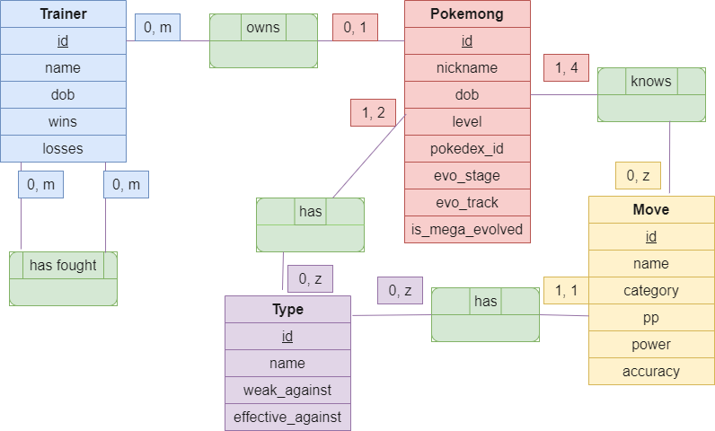
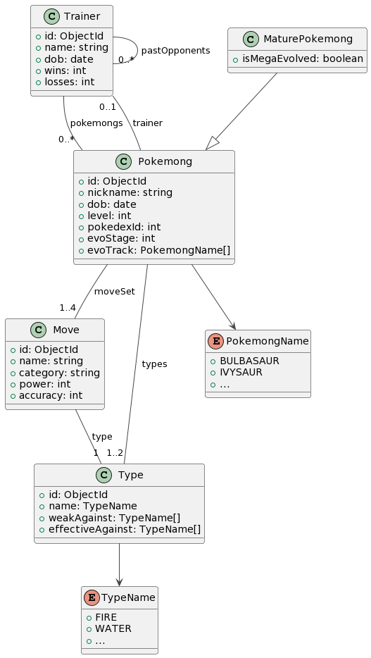

# PoKeMoNg

This is a [Quarkus](https://quarkus.io/) / [MongoDB](https://mongodb.com/) app for educational purposes.

Instructions are [here](https://clientserveur-courses.clubinfo-clermont.fr/Notation.html) for reference.

## About

A "Pokemong" is a playful term for a MongoDB pocket monster.

The application is developed using the Quarkus framework and uses MongoDB as its database.

This application is a RESTful service designed to emulate a basic `Pokemong` management system. It allows users to
perform
CRUD operations on `Pokemongs`, `Trainers`, `Moves`, and `Types`.

### 🗂️ DCM



### 🧬 UML Class diagram



### NoSQL Schema Versioning Strategy

This application uses MongoDB, a NoSQL database, which provides flexibility in our data model. While this flexibility
has
its advantages, it poses a unique challenge when we need to update our data model, specifically when we want to
introduce breaking changes in the existing schema.

We have adopted a schema versioning strategy to overcome this challenge and manage these changes efficiently.

#### Schema Versioning Pattern

Schema versioning is a pattern that involves tagging each document in a collection with a version number. This version
number corresponds to the schema of the document and is used to handle schema changes in the code that reads these
documents.

Each entity in our model extends a `GenericVersionedEntity` class, which includes a `schemaVersion` field. This field is
an integer that starts at 1 and is to be incremented by one with each schema change. Every change to the schema needs to
involve the schema version number being incremented.

#### Incremental Document Migration

When a document is read from the database, the version number in the document is checked. If the version number is less
than the current version, the document is updated to the current version, and the updated document is written back to
the database. This process effectively migrates the document to the current version.

In the example of the `Move` class, the codec's `decodeV1` method handles documents with a `schemaVersion` of less
than `2`. When it reads a document with this version, it updates the `schemaVersion` to `2`, and writes the updated
document back to the database.

```java
Move decodeV1(Document document){
        // ...
        // Increment the schemaVersion to the current version
        move.setSchemaVersion(2);

        // Save the updated Move object back to the database
        moveRepository.persistOrUpdate(move);
        // ...
        }
```

This strategy allows for graceful schema evolution in a NoSQL environment. Instead of requiring all documents to be
migrated at once, which can be a time-consuming operation for large collections, it enables incremental document
migration. This approach also helps to avoid downtime during schema migration, as the application continues to function
correctly regardless of the document version. As documents are read, they are updated to the current schema version,
allowing the schema migration to happen gradually over time. 

However, note that this strategy increases write operations to the database, which could affect application performance.

## Prep steps

### ♨️ Java version

This project is set up to use `Java 17`.

Your build will fail if the version of `Java` that your build tools are using does not match that.

<details><summary>💻 Run from command line</summary>

You should have `JDK 17` installed locally, and accessible to `Gradle`.

That may involve updating your `JAVA_HOME` and `Path` environment variables.

</details>

<details><summary>🛠️ Run from an IDE</summary>

If you're planning to run this app directly from an IDE like IntelliJ, make sure to update any `Gradle JVM` (or similar)
settings to use `JDK 17` for `Gradle` tasks

</details>

### 🔐 Database connection

Note that the DB connection properties are not included -- your `src/main/resources/application.properties` should look
like this :

```properties
quarkus.mongodb.connection-string=mongodb+srv://<username>:<password>@<cluster>.<node>.mongodb.net
quarkus.mongodb.database=<database>
```

<details><summary>🏫 If you are the corrector</summary>

To be able to use this app, update `application.properties` with the provided database secrets.

If none were provided, that was a mistake. Sorry. Please request them to the owner of this repo.

</details> 

<details><summary>👥 If you are another user or developer</summary>

To be able to use this app, first create a MongoDB database, either locally or on
their [Atlas Cloud](https://cloud.mongodb.com/), then update `application.properties` with your database secrets.

You may want to look up the nice [MongoDB official documentation](https://www.mongodb.com/docs/) if you get stuck.

</details> 

## Running the application in dev mode

You can run the application in dev mode using:

```shell script
./gradlew quarkusDev
```

## API testing

### 🧪 Sample dataset

You can find a sample dataset at `docs/sample-dataset/`. Each JSON file contains a collection.

To load the `moves` collection into an existing MongoDB cluster, you may use [MongoDB Shell ("mongosh")](https://www.mongodb.com/docs/mongodb-shell/) to run
```shell script
mongoimport --uri=mongodb+srv://<username>:<password>@<cluster>.<node>.mongodb.net/<databasename> --collection=moves --file=./docs/sample-dataset/moves.json
```

### 🏴‍☠️ SwaggerUI

Thanks to this project's OpenAPI specs, you can explore the API in a lot of ways.
A popular choice is SwaggerUI -- after you run the app, just go to http://localhost:8080/q/swagger-ui and have fun.

⚠️ Unfortunately, Swagger or Quarkus or SmallRye adds the field `id` to all request examples, but in fact ***you should
NOT include id** when you POST or UPDATE a new document.* The app takes care of it for you. Same thing for the field `species` with `Pokemong` documents.

### 🩺 API testing tools

You can use an API testing tool such as [Postman](https://www.postman.com/)
or [Insomnia](https://insomnia.rest/) to test this app.

If you use Postman, you can even import `docs/postman_collection.json`, designed to work with the `🧪 Sample dataset`.

### 📱 Front end (later)

Moving forward, the front end part of this app -- a different project -- might also come into play for trying out this
API.