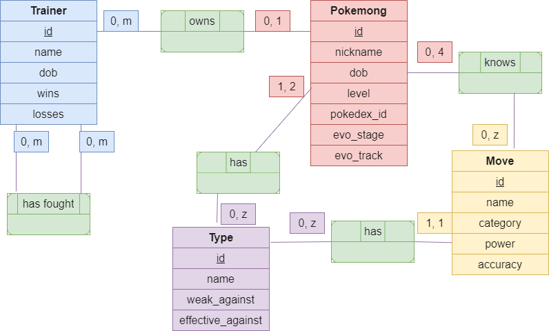

# PoKeMoNg

This is a [Quarkus](https://quarkus.io/) / [MongoDB](https://mongodb.com/) app for educational purposes.

Instructions are [here](https://clientserveur-courses.clubinfo-clermont.fr/Notation.html) for reference.

## About

A "Pokemong" is a playful term for a `MongoDB` pocket monster.

The application is developed using the Quarkus framework and uses `MongoDB` as its database.

This application is a RESTful service designed to emulate a basic Pokemong management system. It allows users to perform
CRUD operations on Pokemongs, trainers, moves, and types.

<details><summary>🗂️ See the DCM</summary>


</details>

<details><summary>🧬 See the UML Class diagram</summary>


</details>

## Prep steps

### ♨️ Java version

This project is set up to use `Java 17`.

Your build will fail if the version of `Java` that your build tools are using does not match that.

<details><summary>💻 Run from command line</summary>

You should have `JDK 17` installed locally, and accessible to `Gradle`.

That may involve updating your `JAVA_HOME` and `Path` environment variables.

</details>

<details><summary>🛠️ Run from an IDE</summary>

If you're planning to run this app directly from an IDE like IntelliJ, make sure to update any `Gradle JVM` (or similar)
settings to use `JDK 17` for `Gradle` tasks

</details>

### 🔐 Database connection

Note that the DB connection properties are not included -- your `src/main/resources/application.properties` should look
like this :

```properties
quarkus.mongodb.connection-string=mongodb+srv://<username>:<password>@<cluster>.<node>.mongodb.net
quarkus.mongodb.database=<database>
```

<details><summary>🏫 If you are the corrector</summary>

To be able to use this app, update `application.properties` with the provided database secrets.

If none were provided, that was a mistake. Sorry. Please request them to the owner of this repo.

</details> 

<details><summary>👥 If you are another user or developer</summary>

To be able to use this app, first create a MongoDB database, either locally or on
their [Atlas Cloud](https://cloud.mongodb.com/), then update `application.properties` with your database secrets.

You may want to look up the nice [MongoDB official documentation](https://www.mongodb.com/docs/) if you get stuck.

</details> 

## Running the application in dev mode

You can run the application in dev mode using:

```shell script
./gradlew quarkusDev
```

## API testing

### 🩺 API testing tools

It is recommended to use an API testing tool such as [Postman](https://www.postman.com/)
or [Insomnia](https://insomnia.rest/), while playing around with this app.

### 📱 Front end (later)

Moving forward, the front end part of this app -- a different project -- might also come into play for trying out this
API.